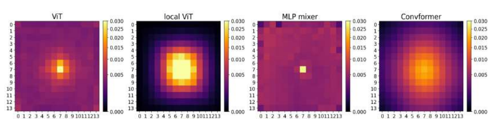
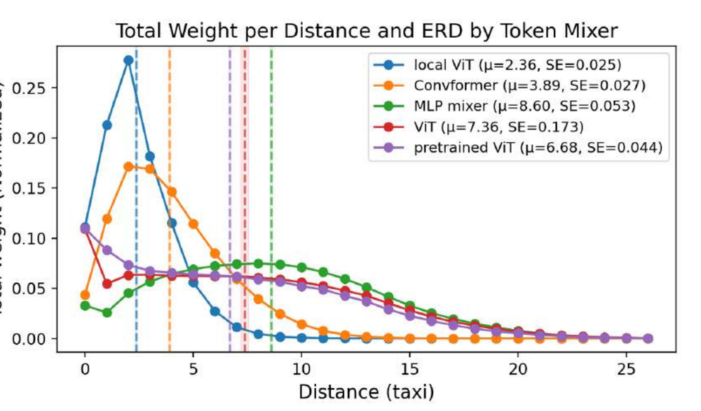
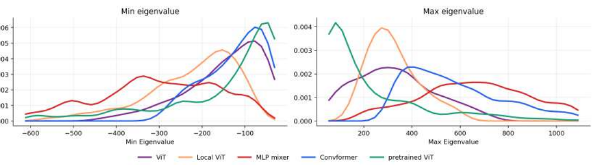
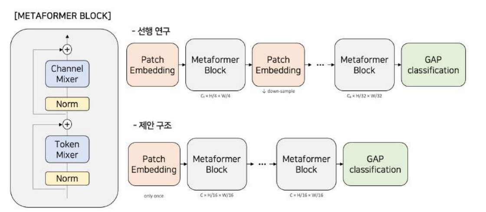

# Which inductive bias actually makes ViT work?

A controlled study of vision-model inductive bias, built on the MetaFormer framework.

Vision Transformers outperform CNNs, and the usual explanation credits two properties of
self-attention: **long range dependency** (any token can reach any other in one step) and
**data specific weight** (the mixing weights are computed from the input). In a standard
ViT-vs-CNN comparison these two are entangled with each other and with everything else
that differs between the architectures — depth, downsampling, stem design, training
recipe — so neither can be credited on its own.

This work fixes the architecture as a MetaFormer and varies **only the token mixer**, so
that the two properties can be switched on and off independently:

| Token mixer | `--model` | Long range dependency | Data specific weight |
|---|---|:---:|:---:|
| ViT (global self-attention) | `vit` | ✓ | ✓ |
| Local ViT (window-masked attention) | `localvit` | ✗ | ✓ |
| MLP mixer (token-wise MLP) | `mlpmixer` | ✓ | ✗ |
| Convformer (grouped convolution) | `convformer` | ✗ | ✗ |
| Identity (no token mixing) | `identity` | — | — |

Beyond accuracy, the study asks *how* each model solves the task, using CKA, a loss
landscape Hessian spectrum, and **Effective Receptive Distance (ERD)** — a metric
proposed here that measures how far a trained model actually looks.

📄 **[Full report (PDF, Korean)](report/학자연_기말보고서.pdf)** — Seoul National
University, 2026-1 Student-Directed Research Program.

---

## Findings

**Long range dependency decides how the model solves the problem; data specific weight
mostly reshapes the loss landscape.**

1. **The structural bias survives training, measurably.** ERD orders the models exactly
   as their architecture predicts — mixers given long-range dependency end up looking
   3–6 patches further than those that are not. The ordering holds across patch counts,
   datasets, and even for a model pretrained on ImageNet-21k.

2. **Long-range models reason in one step; local models reason in stages.** CKA shows
   Convformer and Local ViT forming block-diagonal structure — low-level features early,
   integrated late, like a CNN — while ViT and the MLP mixer produce one broad, uniform
   similarity pattern across depth.

3. **Data specific weight trades flatness against convexity.** Mixers that have it (ViT,
   Local ViT) converge to points with smaller maximum Hessian eigenvalues than Convformer
   — flatter — but with larger-magnitude negative eigenvalues — less convex. This
   reproduces the flatness/convexity trade-off of *How Do Vision Transformers Work?* in a
   setting where the token mixer is the only thing that changed.

4. **At this data scale, restriction wins.** Convformer, with neither property, is the
   most accurate model on both datasets. Long-range dependency needs data to pay off.

> **Scope.** All conclusions are drawn on small datasets (CIFAR-100, Tiny ImageNet). The
> accuracy ranking in particular is expected to shift with scale; see
> [experimental/](experimental/) for the unfinished ImageNet-100 extension.

### Accuracy (report Table 2)

| Dataset | Model | Params | Top-1 / Top-5 (%) | NLL |
|---|---|---:|---:|---:|
| CIFAR-100 | Identity | 3.77M | 60.63 / 83.42 | 2.73 |
| | ViT | 5.54M | 78.14 / 92.94 | 1.77 |
| | Local ViT | 5.54M | 77.07 / 92.69 | 2.05 |
| | MLP mixer | 5.58M | 74.76 / 91.23 | 1.44 |
| | **Convformer** | 3.79M | **81.29** / 93.79 | 1.87 |
| Tiny ImageNet | Identity | 3.78M | 45.78 | 1.48 |
| | ViT | 5.56M | 64.02 | 0.98 |
| | Local ViT | 5.56M | 62.59 | 1.11 |
| | MLP mixer | 5.60M | 61.33 | 0.77 |
| | **Convformer** | 3.81M | **66.15** | 1.06 |

The MLP mixer has the lowest accuracy but also the lowest NLL on both datasets — it
overfits hardest at this data scale.

### Effective Receptive Distance

ERD treats the normalized Effective Receptive Field of an anchor patch as a probability
distribution over input patches, and takes its expected L1 distance:

```
ERD = (1 / P²) · Σ  ( |i−k| + |j−l| ) · ERF(Y_ij, X_kl)
              i,j,k,l
```

It is architecture- and dataset-agnostic, so it can compare any two vision models.



*ERF for the centre anchor patch. Structurally local mixers decay quickly away from the
anchor; long-range mixers keep weight far out.*



*ERD: local ViT 2.36 < Convformer 3.89 < pretrained ViT 6.68 < ViT 7.36 < MLP mixer 8.60.
Within a locality class, the mixer with data specific weight has the smaller ERD — it
concentrates more weight on nearby patches.*

### Loss landscape



*Per-minibatch extreme Hessian eigenvalues at convergence. The pretrained ViT is the
flattest and most convex; the MLP mixer is the sharpest and least convex, matching its
weaker accuracy.*

---

## Architecture



A MetaFormer block is `Norm → TokenMixer → residual`, then `Norm → ChannelMixer →
residual`. This study's variant differs from the original MetaFormer paper in two ways,
both to remove confounds: the MLP module is named and generalized as a **channel mixer**,
and the **multi-stage downsampling hierarchy is dropped** in favour of a single stage at
fixed resolution, so the token mixer is the only thing that varies.

Tensors stay `[B, C, H, W]` end to end — the channel mixer is built from 1×1 convolutions
rather than linear layers, and mixers that need a sequence reshape internally.

```
Input → PatchEmbed (Conv2d, stride=patch) → [B, C, H/p, W/p]
      → AddPositionEmb (optional)
      → N × MetaFormerBlock(TokenMixer, ChannelMixer)
      → Norm → GlobalAvgPool → Linear → logits
```

### Where things live

```
models/
  metaformer.py      MetaFormer, MetaFormerBlock, PatchEmbed, LayerScale, DropPath
  token_mixers.py    Attention (ViT), ConvAttention (Local ViT), MLPMixer, ConvFormer
  channel_mixers.py  Mlp, SwiGLU
  norm_layers.py     LayerNorm / BatchNorm / GroupNorm / RMSNorm for [B, C, H, W]
  pretrained_vit.py  ImageNet-21k ViT-B/16 reference model, GAP head
config/              base.yaml + one file per token mixer
utils/
  config.py          argparse + YAML layering (base -> model -> CLI)
  dataset.py         CIFAR-100 / Tiny ImageNet / ImageNet-100, DeiT augmentation
  build_model.py     rebuild a model from a saved run and load its checkpoint
analysis/            ERF/ERD, CKA, Hessian spectrum, and their plotting scripts
experimental/        explored but not in the report — see experimental/README.md
```

To add a token mixer: implement `__init__(self, dim, ...)` and `forward(x)` over
`[B, C, H, W]` in `models/token_mixers.py`, add a branch in `setup()` in `train.py`, and
add a config.

---

## Setup

Python 3.12, PyTorch 2.10.

```bash
python -m venv .venv && source .venv/bin/activate
pip install -r requirements.txt
```

`requirements.txt` pins the CUDA 12.8 builds of torch/torchvision used for the
experiments. On CPU or a different CUDA version, install torch first from
[pytorch.org](https://pytorch.org) and then the rest:

```bash
pip install torch torchvision                    # your platform's build
pip install -r requirements.txt --no-deps
```

CIFAR-100 and Tiny ImageNet download automatically to `./data` on first run.

W&B logging is on by default. Either point it at your own entity, or turn it off:

```bash
python train.py ... --wandb_entity <your-entity>   # log to your account
python train.py ... --no_wandb                     # no logging
```

---

## Training

Configs are the source of truth; CLI flags override them. `--device_type` is the CUDA
device index and is always required, even on CPU.

```bash
# One model
python train.py --config config/vit.yaml --run_name vit --device_type 0

# Tiny ImageNet instead of CIFAR-100 (swap the base config)
python train.py --base_config config/base_tinyimagenet.yaml \
                --config config/convformer.yaml --run_name convformer --device_type 0

# Override anything
python train.py --config config/vit.yaml --device_type 0 --epochs 50 --train_batch_size 256
```

`run.sh` and `run_tinyimagenet.sh` hold the full sweeps behind the reported numbers.

Each run writes to `output/{project}/{run_name}-{timestamp}/`:

| File | Contents |
|---|---|
| `config.yaml` | the fully resolved config — this is what the analysis pipeline reads back |
| `best.pt` | best checkpoint by validation accuracy |
| `epoch_warmup_end.pt` | checkpoint at the end of warmup |
| `epoch_{100,200,...}.pt` | periodic checkpoints |

Reported setting: `embed_dim` 192, `depth` 12, patch 16 at 224×224, AdamW at 6.67e-4,
batch 512, cosine schedule with 20 warmup epochs, 1000 epochs, DeiT-style augmentation
(RandAugment, Mixup, CutMix, repeated augmentation) with label smoothing and stochastic
depth. Per-model deviations are in the report's Appendix A and in each config file.

---

## Analysis

Every analysis runs over a whole project directory — one training run per subdirectory —
and reads each run's saved `config.yaml` to rebuild the model.

```bash
python run_analysis.py --list                              # what's available
python run_analysis.py -p output/model_resized -a erf      # ERF + ERD    (Section 5.1)
python run_analysis.py -p output/model_resized -a cka      # CKA          (Section 5.2)
python run_analysis.py -p output/model_resized -a hessian_spectrum  #     (Section 5.3)
python run_analysis.py -p output/model_resized              # all of them
```

| `-a` name | Produces | Report |
|---|---|---|
| `erf` | ERF heatmaps and the ERD distance curve | §5.1, Fig 4–5 |
| `erf_layers` | Layer-wise ERF / ERD | Appendix D |
| `cka` | CKA heatmaps for every pair of runs (including self-pairs) | §5.2, Fig 6–7 |
| `hessian_spectrum` | Min/max Hessian eigenvalue densities via Lanczos | §5.3, Fig 8 |
| `loss_landscape` | Top-n Hessian eigenvalues per batch (needs `pyhessian`) | — |
| `params` | Trainable parameter counts | Table 2 |

Useful flags:

```bash
# a different checkpoint, or several — e.g. warmup-end vs. converged
python run_analysis.py -p output/model_resized -a hessian_spectrum \
    --ckpt_names epoch_warmup_end.pt best.pt

# tune an analysis without touching the source
python run_analysis.py -p output/model_resized -a erf --num_images 100 --distance_metric taxi
python run_analysis.py -p output/model_resized -a hessian_spectrum --num_batches 50 --lanczos_steps 20
```

Results land under `analysis_output/`. `run_analysis.py --help` lists every flag with its
report default; the scripts that assemble the combined figures are
`analysis/visualize_erf.py` and `analysis/visualize_hessian_spectrum.py`.

Note that the Hessian analyses need double backward, so they unwrap `torch.compile` and
run considerably slower than training steps.

---

## Authors

Seoul National University, College of Engineering, Dept. of Computer Science and
Engineering — 2026-1 Student-Directed Research Program.

- **Sunghoon Kim** (2025-19744)
- **Yunwoo Koo** (2025-13923)
- **Minseop Lee** (2025-17674)

Advisor: Prof. Jaesik Park · Graduate mentor: Daeun Lee

This is joint work by all three authors; the report is a shared product.

## License

Apache-2.0 — see [LICENSE](LICENSE). Parts of this repository are adapted from other
projects (PoolFormer/MetaFormer, RepLKNet, davda54/sam); see [NOTICE](NOTICE) for
per-file attribution and for the terms attached to the datasets and pretrained weights
the code downloads.

## References

Key prior work; the full bibliography is in the report.

- Yu et al., *MetaFormer is Actually What You Need for Vision*, CVPR 2022
- Park and Kim, *How Do Vision Transformers Work?*, ICLR 2022
- Kornblith et al., *Similarity of Neural Network Representations Revisited*, ICML 2019
- Luo et al., *Understanding the Effective Receptive Field in Deep CNNs*, NeurIPS 2016
- Dosovitskiy et al., *An Image is Worth 16x16 Words*, ICLR 2021
- Tolstikhin et al., *MLP-Mixer: An all-MLP Architecture for Vision*, NeurIPS 2021
